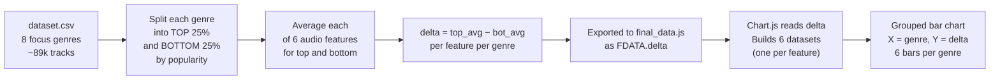

# "The Sound of Success" — Chart 3 Complete Breakdown

---

## First — What Is This Chart Actually Trying to Answer?

The core question is:

> **"Do popular songs in a genre sound different from unpopular songs in the same genre?"**

Not across all songs. **Within each genre separately.** The chart is built to reveal whether there is a measurable "audio fingerprint" that separates hits from flops — and if so, what that fingerprint looks like.

---

## Part 1 — Understanding the Key Concepts

### Concept 1: Quartiles

Imagine ranking all pop songs from least popular (rank 1) to most popular (rank last).

- **Bottom 25% (Q1)** — the 25% of songs with the **lowest** popularity scores. These are the flops.
- **Top 25% (Q3)** — the 25% of songs with the **highest** popularity scores. These are the hits.

The middle 50% is ignored entirely. This is intentional — you want to compare the **extremes** to get the clearest signal.

```
All songs ranked by popularity:
│◄── 25% flops ──►│◄────── middle 50% ignored ──────►│◄── 25% hits ──►│
     (bottom)                                               (top)
```

### Concept 2: The Delta (Difference)

For each audio feature (e.g., `energy`), you compute:

```
delta = average_energy_of_hits  −  average_energy_of_flops
```

- **delta > 0** means hits have more of that feature than flops
- **delta < 0** means hits have less of that feature than flops
- **delta ≈ 0** means the feature barely differs between hits and flops

### Concept 3: The Chart is Grouped Bars

The chart has:
- **X-axis** → the 8 genres (pop, hip-hop, rock, jazz, classical, electronic, metal, r-n-b)
- **Y-axis** → the delta value (range: −0.2 to +0.2)
- **6 coloured bars per genre** → one bar per audio feature
- **A bar above 0** → popular songs in that genre have **more** of that feature
- **A bar below 0** → popular songs in that genre have **less** of that feature

The Y-axis label literally says: **"Top quartile − Bottom quartile"**

---

## Part 2 — The Python Code (Step by Step)

This is computed in `export_dashboard_data()` inside `spotify_visualizations.py`.

### Step 1 — Define which features to compare

```python
compare_features = [
    "danceability", "energy", "valence",
    "acousticness", "speechiness", "instrumentalness"
]
```

These 6 features are chosen because they all live on a 0–1 scale, making comparisons fair.

### Step 2 — Loop through each of the 8 genres

```python
for genre, grp in df_focus.groupby("track_genre"):
```

`grp` is a sub-DataFrame containing only the tracks for that one genre.

### Step 3 — Find the quartile cut-off points

```python
q25 = grp["popularity"].quantile(0.25)   # value below which 25% of songs fall
q75 = grp["popularity"].quantile(0.75)   # value above which 25% of songs fall
```

These are **threshold numbers**, not rows. For example, for pop music:
- `q25` might be `18` — meaning songs with popularity ≤ 18 are in the bottom 25%
- `q75` might be `52` — meaning songs with popularity ≥ 52 are in the top 25%

### Step 4 — Split the genre into two groups

```python
bot = grp[grp["popularity"] <= q25]   # flop songs
top = grp[grp["popularity"] >= q75]   # hit songs
```

Each of these is a filtered DataFrame. Only songs at the extreme ends are kept.

### Step 5 — Average the audio features for each group

```python
top_mean = top[compare_features].mean().fillna(0)
bot_mean = bot[compare_features].mean().fillna(0)
```

For each group, compute the average of every feature. `.fillna(0)` replaces any missing values with 0.

Result example for pop hits:
```
danceability: 0.672
energy:       0.614
valence:      0.488
...
```

### Step 6 — Compute the delta

```python
sound_success["delta"][genre] = {
    f: round(float(top_mean[f] - bot_mean[f]), 4)
    for f in compare_features
}
```

This subtracts the flop average from the hit average for every feature. The result is stored per genre.

Example output for `pop`:
```python
{
  "danceability":  0.041,   # hits are slightly more danceable
  "energy":        0.023,   # hits are slightly more energetic
  "valence":      -0.015,   # hits are slightly less happy (small difference)
  "acousticness": -0.052,   # hits are less acoustic
  "speechiness":   0.006,   # barely any difference
  "instrumentalness": -0.008
}
```

### Step 7 — Export to final_data.js

```python
final_payload = {
    "feat6": compare_features,   # the 6 feature names (used as legend)
    "delta": sound_success["delta"],   # dict of {genre: {feature: delta_value}}
    ...
}
```

This is written to `final_data.js` as `window.FDATA`.

---

## Part 3 — The JavaScript (Chart.js, index.html lines 750–767)

```js
(function() {
  // Step 1 — Load the 6 feature names and genre list
  const feats  = D.feat6;    // ["danceability","energy","valence","acousticness","speechiness","instrumentalness"]
  const labels = GENRES;     // ["pop","hip-hop","rock","jazz","classical","electronic","metal","r-n-b"]

  // Step 2 — Assign a colour to each feature
  const fColors = ['#1DB954','#f15e6b','#e8a723','#2e77d0','#7c4dbe','#00b4b4'];
  //               danceability  energy   valence  acoustic  speech   instrument

  // Step 3 — Build one dataset per feature
  const datasets = feats.map((f, fi) => ({
    label: f,
    // For each genre, look up its delta for this feature
    data: labels.map(g => D.delta[g] ? D.delta[g][f] : 0),
    backgroundColor: fColors[fi] + 'bb',  // colour with ~73% opacity
    borderColor: 'transparent',
    borderWidth: 0,
    borderRadius: 2   // slightly rounded bar tops
  }));

  // Step 4 — Render as a grouped bar chart with Chart.js
  new Chart(document.getElementById('c2'), {
    type: 'bar',
    data: { labels, datasets },
    options: {
      responsive: true,
      maintainAspectRatio: false,
      plugins: {
        legend: { labels: { color: '#6a6a6a', boxWidth: 8, font: { size: 8 } } }
      },
      scales: {
        x: {
          ticks: { color: '#6a6a6a', maxRotation: 30 },
          grid: { display: false }
        },
        y: {
          title: { display: true, text: 'Top quartile − Bottom quartile', color: '#6a6a6a', font: { size: 8 } },
          ticks: { color: '#6a6a6a' },
          grid:  { color: '#282828' },
          min: -0.2,
          max:  0.2   // Y axis range locked to -0.2 → +0.2
        }
      }
    }
  });
})();
```

### Key design decisions explained:

| Decision | Why |
|---|---|
| **6 bars per genre group** | One bar per audio feature — shows the full profile, not just one feature |
| **Y-axis capped at ±0.2** | Deltas are small (features are 0–1 scale). ±0.2 gives enough room without distorting |
| **Baseline at 0** | Makes it visually obvious whether hits have MORE (bar up) or LESS (bar down) |
| **Semi-transparent fill (`bb`)** | Bars overlap in a tight group; transparency makes them readable |
| **`D.delta[g] ? D.delta[g][f] : 0`** | Safety check — if no delta data exists for a genre, use 0 instead of crashing |

---

## Part 4 — How to Read the Chart (A Visual Guide)

```
Y-axis
+0.20 ─────────────────────────────────────────────
      |  ▲ bars above zero = hits have MORE of this
+0.10 |
      |
  0   ├──────────────────────────────────────────── ← the baseline (no difference)
      |
-0.10 |  ▼ bars below zero = hits have LESS of this
      |
-0.20 ─────────────────────────────────────────────
       pop  hip-hop  rock  jazz  classical  ...
```

**Reading a single bar:**  
Suppose in the `metal` genre, the **energy** bar (red) is at `+0.12`.  
That means: *"Metal songs in the top 25% by popularity have, on average, 0.12 more energy than metal songs in the bottom 25%."*  
→ In metal, **being more energetic is associated with being more popular.**

**Reading a bar below zero:**  
If the **acousticness** bar is at `−0.08` for rock:  
→ *"Popular rock songs are less acoustic than unpopular rock songs."*  
→ In rock, **acoustic production is associated with lower popularity.**

---

## Part 5 — What the Results Show

> [!IMPORTANT]
> The chart's core message: **there is no universal hit formula.** Every genre has its own pattern.

Some patterns you can read from the bars:

| Genre | What makes a hit (positive bars) | What doesn't help (negative bars) |
|---|---|---|
| **Electronic** | Higher energy | Less acoustic, less speechy |
| **Classical** | Higher acousticness | Much less energy, much less danceability |
| **Hip-hop** | More speechiness, more danceability | Less instrumental |
| **Jazz** | Higher acousticness | Less energy |
| **Metal** | Higher energy | Less acoustic, less valence (darker songs popular) |
| **Pop** | Slightly more danceability | Less acoustic |

> [!NOTE]
> Classical and Metal are the most extreme opposites. Classical hits are more acoustic and calm; Metal hits are more energetic and loud. The same audio fingerprint would describe a flop in one genre and a hit in another.

---

## Part 6 — The Complete Data Flow



---

## Quick Reference Summary

| Element | What it represents |
|---|---|
| **X-axis groups** | Each of the 8 genres |
| **Y-axis value** | `average(top 25%) − average(bottom 25%)` for one feature |
| **Bar above 0** | Hits have MORE of this feature in this genre |
| **Bar below 0** | Hits have LESS of this feature in this genre |
| **Bar near 0** | Feature barely differs between hits and flops |
| **6 bar colours** | One colour per audio feature (see legend) |
| **Y-axis range ±0.2** | All features are 0–1 scale; deltas rarely exceed ±0.2 |
| **Key finding** | No single feature predicts popularity universally — it's genre-specific |
