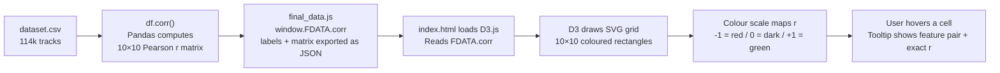

# Feature Correlation Heatmap — Complete Breakdown (Chart 2)

---

## Part 1 — The Conceptual Basics

### What is Correlation?

**Correlation** tells you how two numbers move together. Ask yourself:  
*"When feature A goes up, does feature B tend to go up too — or go down — or does it not care at all?"*

That relationship is expressed as a single number called the **Pearson correlation coefficient**, written as **r**.

### The Pearson r Scale

| r value | What it means |
|---|---|
| **+1.0** | Perfect positive: both always move together |
| **+0.5** to **+1.0** | Strong positive relationship |
| **~0** | No relationship at all (flat cloud of points) |
| **−0.5** to **−1.0** | Strong negative: when one goes up, the other goes down |
| **−1.0** | Perfect negative: they always move in opposite directions |

> [!NOTE]
> Correlation does NOT mean causation. A high r just means the numbers move together — it does not explain *why*.

**Concrete example from this dataset:**  
Energy and Loudness have r ≈ **+0.84**. Louder production almost always sounds more energetic. When energy is high, loudness is high. They move together.

### What is a Heatmap?

A heatmap is a **grid of coloured squares** where:
- **Each row** = one feature (e.g., `energy`)
- **Each column** = one feature (e.g., `loudness`)
- **Each cell** = the Pearson r value between those two features
- **The colour** encodes the r value visually

Instead of reading a table of 100 numbers, you scan colours instantly.

---

## Part 2 — The Features in This Heatmap

The Python file builds the heatmap from these **10 features**:

```python
corr_cols = AUDIO_FEATURES + ["popularity", "tempo", "loudness"]
# AUDIO_FEATURES = ["danceability", "energy", "speechiness",
#                   "acousticness", "instrumentalness", "liveness", "valence"]
# so corr_cols = 7 audio + 3 extra = 10 total columns
```

| Feature | What it measures | Range |
|---|---|---|
| `danceability` | How suitable for dancing (rhythm, beat stability) | 0–1 |
| `energy` | Perceptual intensity and activity | 0–1 |
| `speechiness` | Presence of spoken words | 0–1 |
| `acousticness` | Likelihood the track is acoustic | 0–1 |
| `instrumentalness` | Predicts no vocals | 0–1 |
| `liveness` | Audience presence / live recording | 0–1 |
| `valence` | Musical positiveness (happy vs sad) | 0–1 |
| `popularity` | Spotify stream-based score | 0–100 |
| `tempo` | Beats per minute | ~50–220 |
| `loudness` | Average loudness in dB | ~−60 to 0 |

---

## Part 3 — The Python Code (Step by Step)

### Step 1 — Load the full dataset

```python
df = pd.read_csv(DATASET_PATH)
df.dropna(inplace=True)
df.drop_duplicates(subset=["track_id"], inplace=True)
```

- Loads ~114,000 tracks from `dataset.csv`
- Removes any row with missing values
- Removes duplicate tracks (same `track_id` kept once only)

---

### Step 2 — Compute the Correlation Matrix

```python
corr_cols = AUDIO_FEATURES + ["popularity", "tempo", "loudness"]
corr_df = df[corr_cols].corr().round(3)
```

`.corr()` is a **single Pandas method** that:
1. Takes every pair of columns (e.g., `energy` vs `loudness`)
2. Calculates the Pearson r between them
3. Returns a **10 × 10 matrix** where `matrix[i][j]` = correlation between column i and column j

`.round(3)` trims to 3 decimal places (e.g., `0.8412` → `0.841`).

The diagonal of this matrix is always **1.0** — every feature perfectly correlates with itself.

---

### Step 3 — Export as JSON for the Frontend

```python
corr_labels = corr_df.columns.tolist()   # ["danceability", "energy", ...]
corr_matrix = corr_df.values.tolist()    # 10x10 list of floats

# Saved into final_data.js:
payload["corr"] = {
    "labels": corr_labels,
    "matrix": corr_matrix,
}
```

`corr_matrix[i][j]` is the r-value between feature `corr_labels[i]` and feature `corr_labels[j]`.

The whole thing is dumped to **`final_data.js`** as a JS global variable:
```js
window.FDATA = { ..., "corr": { "labels": [...], "matrix": [[...], ...] }, ... }
```

---

### Step 4 — The Python static version (viz1_correlation_heatmap)

This is the **Matplotlib/Seaborn** version (saved as a PNG image):

```python
def viz1_correlation_heatmap():
    fig, ax = plt.subplots(figsize=(10, 8))

    num_cols = AUDIO_FEATURES + ["popularity", "tempo", "loudness", "duration_ms"]
    corr = df[num_cols].corr()

    mask = np.triu(np.ones_like(corr, dtype=bool))  # hide upper triangle
    cmap = sns.diverging_palette(10, 145, s=80, l=40, as_cmap=True)

    sns.heatmap(
        corr, mask=mask, cmap=cmap, vmax=1, vmin=-1, center=0,
        annot=True, fmt=".2f",                    # show numbers in each cell
        annot_kws={"size": 9, "color": "white"},
        square=True,                               # cells are perfect squares
        linewidths=0.5, linecolor="#1e1e1e",       # grid lines between cells
        cbar_kws={"shrink": 0.8, "label": "Pearson r"},
        ax=ax
    )
```

Key arguments explained:

| Argument | What it does |
|---|---|
| `mask=np.triu(...)` | Hides the upper-right triangle — the matrix is symmetric so you only need half |
| `cmap=sns.diverging_palette(10,145,...)` | Red (10°) → neutral → Green (145°) colour scale |
| `vmax=1, vmin=-1, center=0` | Sets the colour range: 0 is neutral grey, +1 is full green, -1 is full red |
| `annot=True, fmt=".2f"` | Prints the r value (e.g., `0.84`) inside each cell |
| `square=True` | Forces each cell to be a perfect square |
| `linewidths=0.5` | Thin separator lines between cells |

---

## Part 4 — The Interactive Heatmap in the Dashboard (D3.js)

The live dashboard uses **D3.js** (Data-Driven Documents) instead of Matplotlib. The code is in `index.html` at lines 769–791.

### The full heatmap code with every line explained:

```js
(function() {
  // Step 1 — Pull the pre-computed data
  const labels = D.corr.labels;   // ["danceability","energy", ...] — 10 names
  const matrix = D.corr.matrix;   // 10×10 array of Pearson r values
  const n = labels.length;        // n = 10

  // Step 2 — Define pixel dimensions
  const sz = 34;   // each cell is 34×34 pixels
  const pad = { top: 8, left: 88, bottom: 86, right: 8 };
  // left=88 for row labels, bottom=86 for angled column labels

  const W = sz * n + pad.left + pad.right;   // total SVG width
  const H = sz * n + pad.top  + pad.bottom;  // total SVG height

  // Step 3 — Create the SVG element inside the #heatmap div
  const svg = d3.select('#heatmap')
    .append('svg')
    .attr('width', '100%')           // fills the card width
    .attr('viewBox', `0 0 ${W} ${H}`); // scales correctly on all screen sizes

  // Step 4 — Define the colour scale
  const cScale = d3.scaleSequential()
    .domain([-1, 1])                 // maps r=-1 to r=+1
    .interpolator(t => {
      // t goes from 0.0 to 1.0 (domain -1 → +1 mapped to 0 → 1)
      if (t < 0.5)
        return d3.interpolateRgb('#f15e6b', '#121212')(t * 2);
        // t=0 (r=-1) → red  |  t=0.5 (r=0) → dark grey
      return d3.interpolateRgb('#121212', '#1DB954')((t - 0.5) * 2);
        // t=0.5 (r=0) → dark grey  |  t=1 (r=+1) → Spotify green
    });

  // Step 5 — Create a group element, shifted by padding
  const g = svg.append('g')
    .attr('transform', `translate(${pad.left}, ${pad.top})`);

  // Step 6 — Draw one rectangle per cell (nested loop over all pairs)
  labels.forEach((r, i) =>         // i = row index
    labels.forEach((c, j) => {     // j = column index
      const v = matrix[i][j];      // Pearson r for pair (r, c)

      // Draw the coloured square
      g.append('rect')
        .attr('x', j * sz)         // x position = column * cellSize
        .attr('y', i * sz)         // y position = row * cellSize
        .attr('width',  sz - 1)    // -1 leaves a 1px gap (cell separator)
        .attr('height', sz - 1)
        .attr('rx', 3)             // rounded corners (3px radius)
        .attr('fill', cScale(v))   // colour from the scale above
        .style('cursor', 'pointer')
        .on('mousemove', e =>
          showTip(e, `<strong>${r} × ${c}</strong><span>r = ${v.toFixed(3)}</span>`)
        )
        .on('mouseleave', hideTip);

      // Draw the r value text — ONLY if |r| > 0.2 (skip near-zero cells)
      if (Math.abs(v) > 0.2)
        g.append('text')
          .attr('x', j * sz + sz / 2)   // centre of cell horizontally
          .attr('y', i * sz + sz / 2 + 1) // centre vertically (+1 for optical alignment)
          .attr('text-anchor', 'middle')
          .attr('dominant-baseline', 'central')
          .attr('font-size', 7)
          .attr('fill', Math.abs(v) > 0.55 ? '#000' : '#fff')
          // dark text on strongly coloured cells, white on lighter ones
          .attr('opacity', 0.9)
          .text(v.toFixed(2));           // e.g., "0.84"
    })
  );

  // Step 7 — Draw axis labels
  labels.forEach((l, i) => {
    // Column labels — angled -38 degrees at the bottom
    g.append('text')
      .attr('x', i * sz + sz / 2)
      .attr('y', n * sz + 7)
      .attr('text-anchor', 'end')
      .attr('transform', `rotate(-38, ${i * sz + sz / 2}, ${n * sz + 7})`)
      .attr('font-size', 8)
      .attr('fill', '#6a6a6a')
      .text(l);

    // Row labels — right-aligned, left of the grid
    g.append('text')
      .attr('x', -5)
      .attr('y', i * sz + sz / 2)
      .attr('text-anchor', 'end')
      .attr('dominant-baseline', 'central')
      .attr('font-size', 8)
      .attr('fill', '#6a6a6a')
      .text(l);
  });
})();
```

---

## Part 5 — Reading the Colour Scale

```
RED (#f15e6b)  ←──────── DARK GREY (#121212) ────────→  GREEN (#1DB954)
     r = -1                    r = 0                          r = +1
  (strong negative)         (no relationship)            (strong positive)
```

- A **bright red** cell means the two features are **inversely linked** (one goes up, the other goes down)
- A **dark near-black** cell means **no relationship**
- A **bright green** cell means **both move together strongly**

---

## Part 6 — What the Results Actually Show

From the data (these are the standout r values the chart reveals):

| Pair | r value | Meaning |
|---|---|---|
| `energy` ↔ `loudness` | **+0.84** | 🟢 Loudest signal: louder tracks feel more intense |
| `energy` ↔ `acousticness` | **−0.73** | 🔴 Acoustic tracks are quieter/calmer |
| `valence` ↔ `danceability` | **+0.39** | 🟡 Happier tracks tend to be more danceable |
| `danceability` ↔ `popularity` | **+0.06** | ⚫ Almost zero — danceable ≠ popular |
| `instrumentalness` ↔ `speechiness` | **−0.20** | Songs with no vocals rarely have speech |
| `tempo` ↔ `energy` | **+0.17** | Weak — fast tempo barely predicts energy |

> [!IMPORTANT]
> The most critical takeaway: **Popularity has weak correlations with almost every audio feature.** This directly supports the "Popularity Myth" conclusion — no single audio feature reliably predicts a hit.

---

## Part 7 — The Complete Data Flow (Summary)



---

## Summary Table

| What | How |
|---|---|
| **Data source** | All 114k tracks from `dataset.csv` (not just 8 genres) |
| **Metric computed** | Pearson r (linear correlation) |
| **Python tool** | `pandas DataFrame.corr()` |
| **Static chart** | `seaborn.heatmap()` → PNG |
| **Interactive chart** | D3.js SVG rectangles in `index.html` |
| **Colour scale** | Red (−1) → Dark grey (0) → Spotify Green (+1) |
| **Text in cells** | Only shown when `|r| > 0.2` to avoid clutter |
| **Hover tooltip** | Shows exact feature pair and r to 3 decimal places |
| **Key finding** | Energy ↔ Loudness (r = 0.84) is the strongest relationship |
